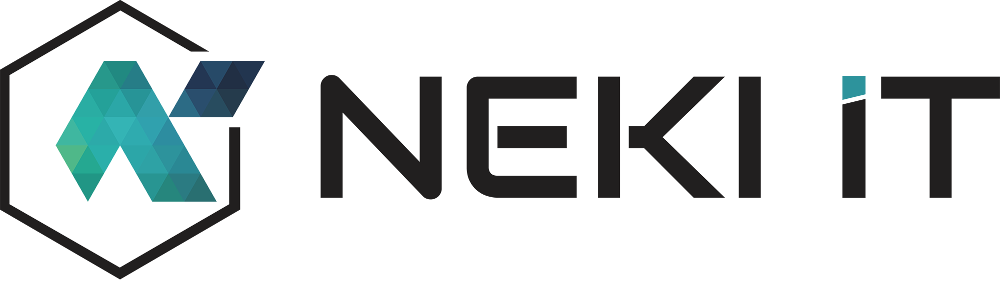

<!-- Coloque aqui o nome do projeto como ele é conhecido internamente e pelos clientes -->

# Nome do Projeto 

> Faça uma breve descrição do seu projeto.

> Link para a Demo [_aqui_](https://www.neki.com.br). <!-- Se você tem o projeto hospedado em algum lugar, inclua o link aqui. -->

## Table of Contents
* [Informações Gerais](#informações-gerais)
* [	Imagens](#imagens)
* [Tecnologias utilizadas](#tecnologias-utilizadas)
* [Configuração de ambiente](#configuração-de-ambiente)
* [Integração Contínua](#integração-contínua)
* [Contato](#contato)

## Informações Gerais
- Forneça aqui informações gerais sobre o seu projeto.
- Que problema ele (pretende) resolver?
- Qual é o objetivo do seu projeto?
<!-- Você não precisa responder a todas as perguntas - apenas as relevantes para o seu projeto. -->

## Imagens

<!-- Se você tiver capturas de tela que gostaria de compartilhar, inclua-as aqui. -->

## Tecnologias utilizadas
- Tech 1 - versão 1.0
- Tech 2 - versão 2.0
- Tech 3 - versão 3.0

## Configuração de ambiente
Quais são os requisitos/dependências do projeto? Onde estão listados? Um arquivo pom.xml ou package.json talvez? Onde está localizado?

Prossiga para descrever como instalar/configurar seu ambiente local/começar com o projeto.

## Integração Contínua

> Jenkins: <!-- URL do projeto no Jenkins --> 

> Sonarqube: <!-- URL do projeto no sonarqube -->  

## Contato
Criado por [@neki](https://www.neki.com.br) - Sinta-se livre para me contatar!
